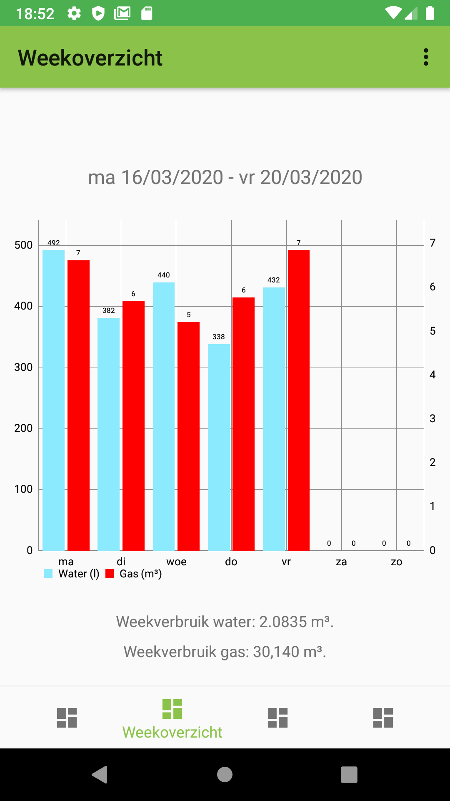

# MijnNutsVerbruik

Deze app leest de informatie van een een water (pulsteller, opgeslagen per kwartier) in en geeft deze weer per dag, week, maand en jaar om inzicht te verkrijgen in het jaarverbruik.

 

 

 

 
